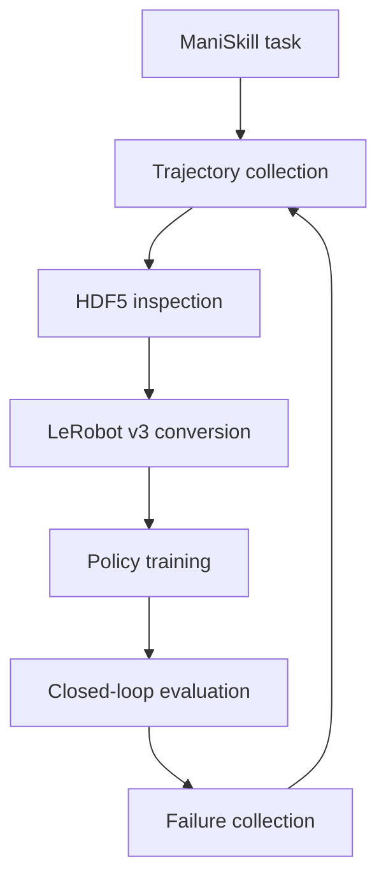

# Embodied AI Learning

A hands-on learning and engineering project for building robot-learning systems with **ManiSkill**, **LeRobot**, imitation learning, Vision-Language-Action models, world models, and multi-source robot data.

The project follows two principles:

1. Learn each concept through a working embodied-agent loop rather than isolated model code.
2. Treat dataset semantics—state, action, frame, timing, embodiment, and source—as first-class engineering concerns.

> **Current status:** Lesson 2 is in its closing phase (sub-steps 2.1–2.8.6 complete). The trajectory → HDF5 → LeRobot pipeline and read-back validation are done, and a minimal BC training loop runs end to end. Next: 2.8.7 train/validation, then 2.8.8 closed-loop execution.

## Project Context

- [Learning roadmap](docs/roadmap_v3.md)
- [Current verified progress](notes/progress.md)
- [Concepts and engineering decisions](notes/concepts.md)
- [Guidance for AI coding agents](AGENTS.md)

The repository files above are the durable source of truth across ChatGPT,
Codex, IDE, and CLI sessions. Git history is used instead of date-suffixed
progress documents.

## Project Goals

- Understand the complete loop from observation and robot state to policy action and environment transition.
- Build a reproducible ManiSkill experimentation environment.
- Convert simulation trajectories into a well-specified robot-learning dataset.
- Train and compare Behavior Cloning, ACT, Diffusion Policy, and VLA-based policies.
- Align simulation, VR teleoperation, and real-robot data through a shared schema.
- Progress toward Sim2Real, Real2Sim, and failure-driven data iteration.

## Learning and Experiment Pipeline



The initial task is `PickCube-v1`. Later stages will introduce a planar pushing task and a contact-rich insertion task without changing the underlying data and evaluation workflow.

## Current Progress

| Stage | Status | Evidence |
|---|---|---|
| Embodied AI foundations | Complete | VLM, VLA, policy, controller, planner, and world-model distinctions |
| Robot representation | Complete | State, observation, coordinate frames, action spaces, and action chunks |
| ManiSkill rollout | Complete | `PickCube-v1` rollout with the full `o_t → a_t → o_{t+1}` loop |
| HDF5 trajectory pipeline | Complete | Observation, action, reward, timestamp, and metadata schema |
| Observation semantics | Complete | 42-dimensional state vector decomposed and documented |
| Action semantics | Complete | The 8-d action is two semantics: arm joint-position **deltas** in `[-0.1,0.1]` rad, and an **absolute** gripper position target in `[-0.01,0.04]` |
| LeRobot conversion | Complete | `dataset[0]` and `DataLoader` read-back verified locally; counts, dtypes, and shapes checked |
| Trajectory replay | Source replay verified | All 50 observations/rewards match; no task success; time-limit truncation. Synthetic timestamps still need correction (50 Hz declared vs 20 Hz actual). |
| Minimal BC training | Complete | MLP `42→128→128→8`, MSE, Adam; training loss `0.346221 → 0.105965` over 100 epochs |
| Train/validation split | Next (2.8.7) | Generalization cannot be assessed yet: one episode, 50 frames, no held-out data |
| Closed-loop execution | Planned (2.8.8) | The trained MLP has never driven `env.step` |
| Expert demonstrations | Complete (2.9) | Motion planner drives `PickCube-v1`; **5/5 episodes succeed**. Expert action smoothness `|Δa| 0.0078` vs random `0.67` |

## Current Dataset

The current `PickCube-v1` state observation has 42 dimensions:

| Component | Dimensions |
|---|---:|
| Robot joint positions (`qpos`) | 9 |
| Robot joint velocities (`qvel`) | 9 |
| Tool-center-point pose | 7 |
| Object pose | 7 |
| Goal position | 3 |
| TCP-to-object relative position | 3 |
| Object-to-goal relative position | 3 |
| Grasp state | 1 |
| **Total** | **42** |

Some task-state components are simulator privileged state and may not be available during real-world deployment. The project therefore distinguishes among:

- deployable policy observations;
- simulator-only privileged supervision;
- task and evaluation metadata.

An action is not considered fully specified by its tensor shape. Every dataset should additionally document:

```text
space, representation, coordinate frame, dimension,
semantics, unit, control frequency, and controller mode
```

## Repository Structure

```text
embodied-ai-learning/
├── README.md
├── AGENTS.md
├── .gitignore
├── archive/                     frozen scripts, see archive/README.md
│   ├── lesson_0_1/
│   ├── lesson_2_superseded/
│   └── offroadmap/
├── datasets/
│   └── README.md
├── docs/
│   └── roadmap_v3.md
├── environment/
│   ├── setup_linux.sh
│   └── setup_linux_v3.sh
├── notebooks/
│   ├── 0_environment_check.ipynb
│   ├── 1.1_state_and_observation.ipynb
│   ├── 1.2_action_space_and_control_modes.ipynb
│   ├── 1.3_coordinate_frames.ipynb
│   ├── 2.1_environment_and_rollout.ipynb
│   ├── 2.3_time_alignment.ipynb
│   ├── 2.4_observation_schema.ipynb
│   ├── 2.5_generate_lerobot_dataset.ipynb
│   ├── 2.6_dataset_dataloader.ipynb
│   ├── 2.7_bc_training_loop.ipynb
│   ├── 2.8_check_data.ipynb     scratch notebook, in active use
│   ├── 2.9_expert_demonstrations.ipynb
│   └── 3.1_imitation_learning_intro.ipynb
├── notes/
│   ├── concepts.md
│   └── progress.md
└── scripts/
    ├── run_pipeline.py            conversion entry point
    ├── pipeline/                  the data path: load, validate, convert,
    │                              post-validate, report, manifest
    ├── observation_adapter.py     deployable versus privileged state partition
    ├── generate_expert_demo.py    motion-planner expert episodes (needs embodied310)
    ├── collect_pickcube_random_rollout.py   source rollout collection
    ├── replay_pickcube_episode.py           acceptance-gate replay evidence
    └── build_lesson_notebooks.py  regenerates the Lesson 1-3 notebooks
```

`scripts/pipeline/` is the supported data path: it is the only place that converts a
trajectory into a trainable dataset, and it is the only place a quality report is
generated. Every other script either produces source data
(`collect_pickcube_random_rollout.py`), proves an acceptance claim
(`replay_pickcube_episode.py`), or is a one-off generator.

Scripts that were retired are listed in `archive/README.md` with the reason and their
replacement. The trajectory-validation checks that used to live in three standalone
scripts now run as cells in `notebooks/2.4_observation_schema.ipynb`.

Notebook names are `lesson_substep_topic.ipynb`, so the filename states which part of
`docs/roadmap_v3.md` the notebook belongs to. `1.x` covers robot representation, `2.x`
the dataset-to-training pipeline, and `3.1` opens imitation learning. The scratch
notebook `2.8_check_data.ipynb` interleaves environment experiments and is not part of
the curated sequence.

All curated notebooks are committed with executed outputs. `scripts/build_lesson_notebooks.py`
regenerates them from source without outputs; re-execute afterwards to repopulate.

`2.9_expert_demonstrations.ipynb` does not construct the motion planner in its own kernel.
A planner call kills the kernel when NumPy is 2.x, because `mplib` 0.1.1 is built against
the NumPy 1.x C API and jumps to address `0x0`. The notebook inspects the action contract
and delegates planning to `scripts/generate_expert_demo.py` in the `embodied310`
environment. See `notes/progress.md` for the isolation evidence.

Scripts superseded by a later stage live under `archive/` rather than being
deleted, so that the evidence trail in `notes/progress.md` stays readable.
Those files are frozen and not maintained.

Large datasets, videos, model checkpoints, caches, and credentials are intentionally excluded from Git.

Real credentials should remain outside the repository. `.gitignore` prevents
Git tracking but is not a file-access security boundary; use operating-system
permissions and sandbox configuration for actual isolation.

## Environment

The project uses two conda environments, split by one hard constraint: ManiSkill pins
`mplib==0.1.1`, and that build requires NumPy 1.x.

| | `embodied` | `embodied310` |
|---|---|---|
| Python | 3.12 | 3.10 |
| NumPy | 2.2.6 | **1.26.4** |
| PyTorch | 2.11.0 (cu128) | 2.14.0 (cu130) |
| ManiSkill / SAPIEN | 3.0.1 / 3.0.3 | 3.0.1 / 3.0.3 |
| lerobot, pyarrow, pandas | yes | no |
| Used for | notebooks, data pipeline | motion planning, expert demos |

**Why two environments.** `mplib` 0.1.1 is compiled against the NumPy 1.x C API. Under
NumPy 2.x its C-API function pointers are invalid and constructing the planner calls
address `0x0`, killing the process with `SIGSEGV` — no exception, just a dead kernel.
Upgrading `mplib` is not an option: ManiSkill 3.0.1 pins `==0.1.1`, and `mplib` 0.2.x
removes API that ManiSkill uses (`Planner.get_joint_pos`, `get_link_pose`,
`get_move_group_joint_indices`) and changes `set_base_pose` to require a `Pose` object.

Common stack: Ubuntu Linux, the NVIDIA RTX 3080 Ti Laptop GPU (CUDA currently
unavailable on this host), [ManiSkill](https://maniskill.readthedocs.io/), and
[LeRobot](https://github.com/huggingface/lerobot).

## Setup

Clone the repository:

```bash
git clone https://github.com/YOUR_USERNAME/embodied-ai-learning.git
cd embodied-ai-learning
```

Run the environment setup script:

```bash
bash environment/setup_linux.sh
conda activate embodied
```

Verify the environment:

```bash
python archive/lesson_0_1/smoke_test_maniskill.py
```

This probe is frozen under `archive/`, but it remains the smallest end-to-end
check that ManiSkill can create and step `PickCube-v1`.

## Basic Workflow

### 1. Collect a ManiSkill rollout

```bash
python scripts/collect_pickcube_random_rollout.py
```

The current collector is intended for pipeline validation. A random rollout is not treated as a successful expert demonstration unless task success is verified.

### 2. Inspect the trajectory

Use the dataset notebook:

```bash
jupyter lab "notebooks/2.2_2.6_inspect_trajectory_and_observation_schema.ipynb"
```

The inspection process checks:

- episode and frame structure;
- observation and action shapes;
- timestamps and inferred control frequency;
- missing, non-finite, or out-of-range values;
- the alignment between `T` actions and the associated state sequence;
- deployable observations versus privileged simulator state.

### 3. Convert to LeRobot v3

Run from the repository root, because the pipeline imports `scripts.pipeline`:

```bash
python scripts/run_pipeline.py
```

The pipeline loads the HDF5 episode, validates it, converts it, re-loads the
result, generates a quality report, and writes a conversion manifest. Pass
`--overwrite` to replace an existing output dataset.

The generated dataset has been loaded back and its episode count, frame count,
features, and first/last frames checked. The remaining known defect is timing:
the manifest declares 50 FPS while the environment's real control rate is 20 Hz,
because the collector synthesizes timestamps and the converter infers FPS from
them. See `notes/progress.md`.

### 4. Generate expert demonstrations

Random rollouts are a pipeline fixture, not supervision: their actions are near-random
(`mean |Δa| ≈ 0.67`). Successful episodes come from ManiSkill's motion planner, and must
run in `embodied310` because `mplib` needs NumPy 1.x:

```bash
~/miniforge3/envs/embodied310/bin/python scripts/generate_expert_demo.py \
    --seeds 0 1 2 3 4 --overwrite
```

This writes `datasets/pickcube/expert_episodes.h5` (5/5 episodes succeed,
`mean |Δa| ≈ 0.0078`). The collector wraps `env.step`, so recorded actions are what the
environment actually executed.

> **Expert episodes are not directly mixable with the random fixture.** The expert data
> is `pd_joint_pos` (absolute joint targets); the fixture is `pd_joint_delta_pos`
> (normalized deltas). Same dimension, different meaning — convert and verify before
> combining them.

## Dataset Compatibility Checklist

Before combining data from ManiSkill, VR teleoperation, or a real robot, the following fields must be compatible or explicitly transformed:

1. Embodiment
2. Observation space
3. Action specification
4. Coordinate-frame convention
5. Sampling and control frequency
6. Observation-action timestamp alignment
7. Task semantics
8. Source and domain metadata

Matching tensor shapes alone do not make two robot datasets compatible.

## Roadmap

- [x] Embodied AI system overview
- [x] Robot state, coordinate frames, and action spaces
- [x] ManiSkill environment setup
- [x] First `PickCube-v1` trajectory
- [x] HDF5 schema inspection
- [x] Complete LeRobot conversion and read-back validation
- [x] Train a state-based Behavior Cloning baseline
- [x] Replay the source trajectory and compare observations/rewards
- [ ] Resolve the declared-FPS versus real-control-rate temporal contract
- [ ] Add a reusable robot-dataset inspection script
- [ ] Split training and validation data (2.8.7)
- [ ] Execute the policy in closed loop (2.8.8)
- [ ] Compare BC, ACT, and Diffusion Policy
- [ ] Add language-conditioned multi-task data
- [ ] Build a ManiSkill-to-VLA adapter
- [ ] Add VR teleoperation demonstrations
- [ ] Evaluate Sim2Real and Real2Sim workflows
- [ ] Build a failure-to-data-to-retraining loop

## Longer-Term Direction

The end-to-end target is:

```text
VR demonstration
→ robot retargeting
→ ManiSkill and real demonstrations
→ unified LeRobot dataset
→ BC / ACT / Diffusion Policy
→ VLA integration
→ closed-loop evaluation
→ real-world deployment
→ failure collection and retraining
```

This direction connects prior experience in XR interaction, first-person sensing, multimodal behavior analysis, task segmentation, and adaptive guidance with modern robot-learning systems.

## Reproducibility Notes

- Dataset files and checkpoints are not committed to this repository.
- Generated data should include the environment ID, robot embodiment, controller configuration, seed, observation mode, action specification, and software versions.
- Results should report closed-loop task success in addition to offline prediction loss.
- Conversion is considered complete only after the generated dataset can be loaded and inspected independently.

## Project Status

This is an active learning and engineering repository. Interfaces and schemas may change as experiments move from state-based simulation toward visual policies, language-conditioned control, VR demonstrations, and real-robot data.
