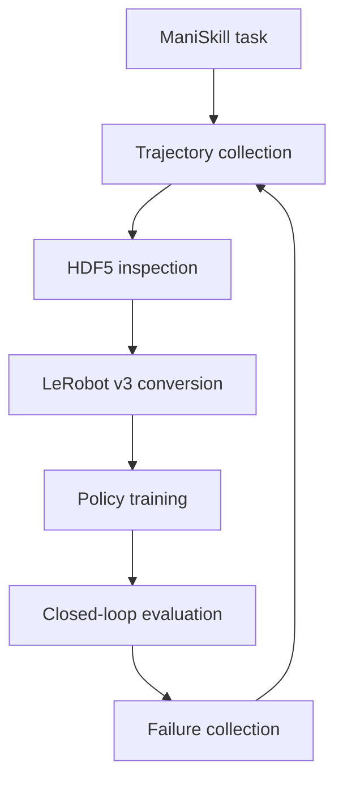

# Embodied AI Learning

A hands-on learning and engineering project for building robot-learning systems with **ManiSkill**, **LeRobot**, imitation learning, Vision-Language-Action models, world models, and multi-source robot data.

The project follows two principles:

1. Learn each concept through a working embodied-agent loop rather than isolated model code.
2. Treat dataset semantics—state, action, frame, timing, embodiment, and source—as first-class engineering concerns.

> **Current status:** Lesson 2 is in progress. The ManiSkill-to-HDF5 pipeline is working; LeRobot v3 conversion and read-back validation are the next milestones.

## Project Context

- [Learning roadmap](docs/roadmap_v3.md)
- [Current verified progress](notes/progress.md)
- [Concepts and engineering decisions](notes/concepts.md)
- [Guidance for AI coding agents](AGENTS.md)

The repository files above are the durable source of truth across ChatGPT,
Codex, IDE, and CLI sessions. Git history is used instead of date-suffixed
progress documents.

## Project Goals

- Understand the complete loop from observation and robot state to policy action and environment transition.
- Build a reproducible ManiSkill experimentation environment.
- Convert simulation trajectories into a well-specified robot-learning dataset.
- Train and compare Behavior Cloning, ACT, Diffusion Policy, and VLA-based policies.
- Align simulation, VR teleoperation, and real-robot data through a shared schema.
- Progress toward Sim2Real, Real2Sim, and failure-driven data iteration.

## Learning and Experiment Pipeline



The initial task is `PickCube-v1`. Later stages will introduce a planar pushing task and a contact-rich insertion task without changing the underlying data and evaluation workflow.

## Current Progress

| Stage | Status | Evidence |
|---|---|---|
| Embodied AI foundations | Complete | VLM, VLA, policy, controller, planner, and world-model distinctions |
| Robot representation | Complete | State, observation, coordinate frames, action spaces, and action chunks |
| Linux/CUDA environment | Complete | PyTorch CUDA and ManiSkill verified |
| ManiSkill rollout | Complete | `PickCube-v1` rollout tested |
| HDF5 trajectory pipeline | Complete | Observation, action, reward, timestamp, and metadata schema |
| Observation semantics | Complete | Current 42-dimensional state vector decomposed and documented |
| LeRobot v3 conversion | In progress | Converter skeleton exists; interface correction, execution, and read-back validation pending |
| Trajectory replay | In progress | Replay and action/state temporal alignment still to be verified |
| Policy training | Planned | State-based BC is the first baseline |

## Current Dataset

The current `PickCube-v1` state observation has 42 dimensions:

| Component | Dimensions |
|---|---:|
| Robot joint positions (`qpos`) | 9 |
| Robot joint velocities (`qvel`) | 9 |
| Tool-center-point pose | 7 |
| Object pose | 7 |
| Goal position | 3 |
| TCP-to-object relative position | 3 |
| Object-to-goal relative position | 3 |
| Grasp state | 1 |
| **Total** | **42** |

Some task-state components are simulator privileged state and may not be available during real-world deployment. The project therefore distinguishes among:

- deployable policy observations;
- simulator-only privileged supervision;
- task and evaluation metadata.

An action is not considered fully specified by its tensor shape. Every dataset should additionally document:

```text
space, representation, coordinate frame, dimension,
semantics, unit, control frequency, and controller mode
```

## Repository Structure

```text
embodied-ai-learning/
├── README.md
├── AGENTS.md
├── .gitignore
├── docs/
│   └── roadmap_v3.md
├── environment/
│   └── setup_linux.sh
├── notebooks/
│   ├── 00_environment_check.ipynb
│   └── 01_inspect_pickcube_dataset.ipynb
├── scripts/
│   ├── smoke_test_maniskill.py
│   ├── collect_pickcube_random.py
│   ├── convert_maniskill_to_lerobot.py
│   └── inspect_robot_dataset.py
├── notes/
│   ├── progress.md
│   └── concepts.md
└── datasets/
    └── README.md
```

Large datasets, videos, model checkpoints, caches, and credentials are intentionally excluded from Git.

Real credentials should remain outside the repository. `.gitignore` prevents
Git tracking but is not a file-access security boundary; use operating-system
permissions and sandbox configuration for actual isolation.

## Environment

Current development environment:

- Ubuntu Linux
- Python 3.12
- PyTorch 2.11.0 with CUDA 12.8
- NVIDIA RTX 3080 Ti Laptop GPU with 16 GB VRAM
- [ManiSkill](https://maniskill.readthedocs.io/)
- [LeRobot](https://github.com/huggingface/lerobot)

## Setup

Clone the repository:

```bash
git clone https://github.com/YOUR_USERNAME/embodied-ai-learning.git
cd embodied-ai-learning
```

Run the environment setup script:

```bash
bash environment/setup_linux.sh
conda activate embodied
```

Verify the environment:

```bash
python scripts/smoke_test_maniskill.py
```

## Basic Workflow

### 1. Collect a ManiSkill rollout

```bash
python scripts/collect_pickcube_random.py
```

The current collector is intended for pipeline validation. A random rollout is not treated as a successful expert demonstration unless task success is verified.

### 2. Inspect the trajectory

Use the dataset notebook:

```bash
jupyter lab notebooks/01_inspect_pickcube_dataset.ipynb
```

The inspection process checks:

- episode and frame structure;
- observation and action shapes;
- timestamps and inferred control frequency;
- missing, non-finite, or out-of-range values;
- the alignment between `T` actions and the associated state sequence;
- deployable observations versus privileged simulator state.

### 3. Convert to LeRobot v3

```bash
python scripts/convert_maniskill_to_lerobot.py
```

This conversion path is currently under validation. Completion requires successfully loading the generated dataset again and checking its episode count, frame count, features, FPS, and first/last frames.

## Dataset Compatibility Checklist

Before combining data from ManiSkill, VR teleoperation, or a real robot, the following fields must be compatible or explicitly transformed:

1. Embodiment
2. Observation space
3. Action specification
4. Coordinate-frame convention
5. Sampling and control frequency
6. Observation-action timestamp alignment
7. Task semantics
8. Source and domain metadata

Matching tensor shapes alone do not make two robot datasets compatible.

## Roadmap

- [x] Embodied AI system overview
- [x] Robot state, coordinate frames, and action spaces
- [x] ManiSkill environment and CUDA setup
- [x] First `PickCube-v1` trajectory
- [x] HDF5 schema inspection
- [ ] Replay and validate a successful trajectory
- [ ] Complete LeRobot v3 conversion and read-back validation
- [ ] Add a reusable robot-dataset inspection script
- [ ] Train a state-based Behavior Cloning baseline
- [ ] Compare BC, ACT, and Diffusion Policy
- [ ] Add language-conditioned multi-task data
- [ ] Build a ManiSkill-to-VLA adapter
- [ ] Add VR teleoperation demonstrations
- [ ] Evaluate Sim2Real and Real2Sim workflows
- [ ] Build a failure-to-data-to-retraining loop

## Longer-Term Direction

The end-to-end target is:

```text
VR demonstration
→ robot retargeting
→ ManiSkill and real demonstrations
→ unified LeRobot dataset
→ BC / ACT / Diffusion Policy
→ VLA integration
→ closed-loop evaluation
→ real-world deployment
→ failure collection and retraining
```

This direction connects prior experience in XR interaction, first-person sensing, multimodal behavior analysis, task segmentation, and adaptive guidance with modern robot-learning systems.

## Reproducibility Notes

- Dataset files and checkpoints are not committed to this repository.
- Generated data should include the environment ID, robot embodiment, controller configuration, seed, observation mode, action specification, and software versions.
- Results should report closed-loop task success in addition to offline prediction loss.
- Conversion is considered complete only after the generated dataset can be loaded and inspected independently.

## Project Status

This is an active learning and engineering repository. Interfaces and schemas may change as experiments move from state-based simulation toward visual policies, language-conditioned control, VR demonstrations, and real-robot data.
