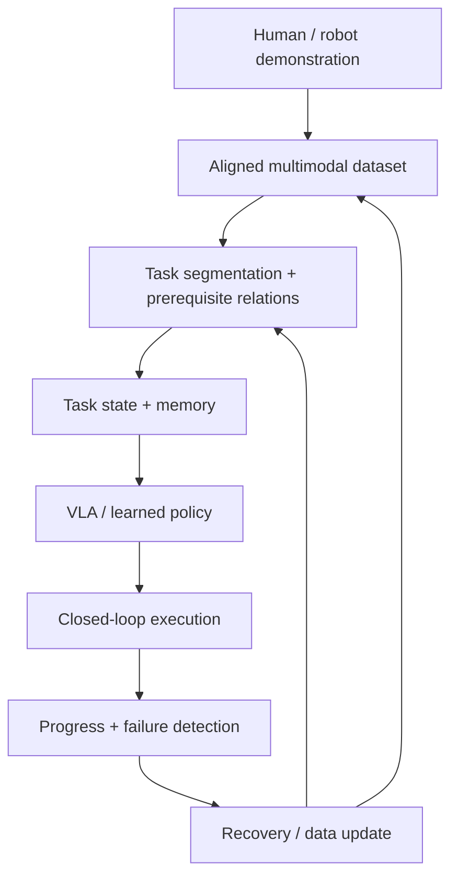

# Embodied AI Learning

A hands-on learning and research project for building **task-centric embodied agents** with deep learning, multimodal perception, Vision-Language-Action models, task memory, world models, and closed-loop action. **ManiSkill** and **LeRobot** remain the experimental and data foundations; the mechanical arm is the embodiment used to test the agent, not the endpoint of the project.

The project follows two principles:

1. Learn each concept through a working embodied-agent loop rather than isolated model code.
2. Treat dataset semantics—state, action, frame, timing, embodiment, and source—as first-class engineering concerns.
3. Move from reactive `observation → action` policies toward agents that represent task phase, memory, prerequisites, progress, and recovery — including re-entering steps that a strict one-directional plan cannot express.

> **Current status:** **Lesson 2 is complete.** The trajectory → HDF5 → LeRobot pipeline and read-back validation are done; a minimal BC baseline trains, is evaluated on a held-out episode, and has been deployed in closed loop. The result is a documented **negative** one: best validation MSE `0.2350` is worse than the mean-action baseline `0.1421`, and on unseen `seed=100` the policy never completes the task, saturating the action bounds on `199/200` steps. The training code is correct — the model is a failure baseline, not a usable policy. Five planner-generated expert episodes are recorded in the canonical `T+1` / `T` schema, with a delta-semantics retargeted copy (`expert_episodes_delta.h5`) verified at 5/5 replay success. Notebook notes are in Chinese with English technical terms. Next phase: **data scaling** (30–50 expert episodes, same episode-level split) and Lesson 3, entering from this measured result. See `notes/progress.md`.

## Project Context

- [Learning roadmap](docs/roadmap_v3.md)
- [Current verified progress](notes/progress.md)
- [Concepts and engineering decisions](notes/concepts.md)
- [Guidance for AI coding agents](AGENTS.md)

The repository files above are the durable source of truth across ChatGPT,
Codex, IDE, and CLI sessions. Git history is used instead of date-suffixed
progress documents.

## Project Goals

- Understand the complete loop from observation and robot state to policy action and environment transition.
- Strengthen practical deep-learning foundations: PyTorch training, Transformer sequence modeling, multimodal representation, fine-tuning, and evaluation.
- Understand the action-policy families as a progression: Behavior Cloning → action chunking (ACT) → Diffusion Policy → flow matching (`π0`-style action experts).
- Build a reproducible ManiSkill experimentation environment.
- Convert simulation trajectories into a well-specified robot-learning dataset.
- Train and compare Behavior Cloning, ACT, Diffusion Policy, and VLA-based policies.
- Explain how a VLA turns image, language, and state tokens into actions, and why action representation decides whether robot data can be mixed.
- Extract task phases, skills, subgoals, and prerequisite relations from demonstrations.
- Track explicit task state, including retry, recovery, and re-entry into already-completed steps.
- Build persistent episodic/procedural memory for long-horizon execution.
- Distinguish physical dynamics models from task world models and connect both to planning.
- Condition policy/VLA execution on instruction, current task state, memory, and subgoal.
- Align simulation, VR teleoperation, and real-robot data through a shared schema.
- Connect prior XR work on gaze, attention, task guidance, and adaptive intervention to human-agent collaboration.
- Progress toward Sim2Real, Real2Sim, recovery, and failure-driven data iteration.

## Learning and Experiment Pipeline



The initial task is `PickCube-v1`. Later stages introduce a planar pushing task, a contact-rich insertion task, and finally a multi-skill long-horizon task. These tasks share the same data, memory, policy, and evaluation interfaces.

## Current Progress

| Stage | Status | Evidence |
|---|---|---|
| Embodied AI foundations | Complete | VLM, VLA, policy, controller, planner, and world-model distinctions |
| Robot representation | Complete | State, observation, coordinate frames, action spaces, and action chunks |
| ManiSkill rollout | Complete | `PickCube-v1` rollout with the full `o_t → a_t → o_{t+1}` loop |
| HDF5 trajectory pipeline | Complete | Observation, action, reward, timestamp, and metadata schema |
| Observation semantics | Complete | 42-dimensional state vector decomposed and documented |
| Action semantics | Complete | The 8-d action is two semantics: arm joint-position **deltas** in `[-0.1,0.1]` rad, and an **absolute** gripper position target in `[-0.01,0.04]` |
| LeRobot conversion | Complete | `dataset[0]` and `DataLoader` read-back verified locally; counts, dtypes, and shapes checked |
| Trajectory replay | Verified (fixture and expert) | Random fixture replays with `0.0` observation/reward error; expert episodes replay exactly, and the retargeted delta actions reproduce the expert trajectory with 5/5 task success. Synthetic timestamps still need correction (50 Hz declared vs 20 Hz actual). |
| Expert data contract | Complete (2.9) | Collector writes `T+1` observations / `T` actions, asserts the control mode, and excludes failed episodes; the post-action-offset and failure-persistence defects were fixed and the dataset regenerated |
| Minimal BC training | Complete | MLP `42→128→128→8`, MSE, Adam; training loss `0.346221 → 0.105965` over 100 epochs |
| Episode-level train/validation | Complete (2.8.7) | 4 training episodes (284 samples) / 1 validation episode (76); training loss `1.3136 → 0.006` while validation stayed at `0.75`–`0.77`; best validation MSE `0.2350` **worse** than the mean-action baseline `0.1421`; early stopping kept epoch 3 |
| Closed-loop execution | Complete (2.8.8) | Best checkpoint deployed with action clipping on unseen `seed=100`; task **not** completed at 50 or 200 steps; `199/200` steps had clipped action channels, which rules out the episode time limit as the cause |
| Expert demonstrations | Complete (2.9) | Motion planner drives `PickCube-v1`; **5/5 episodes succeed**. Expert action smoothness `|Δa| 0.0078` vs random `0.67` |

**Lesson 2 result:** the BC model fitted the training demonstrations but did not
generalize to an unseen episode, and the closed-loop rollout confirms it cannot
complete the task. The training code is correct; the model is a documented
**failure baseline**, not a usable policy. Reaching a usable policy is a data
problem next: at least 30–50 expert episodes, re-trained with the same
episode-level split.

## Current Dataset

The current `PickCube-v1` state observation has 42 dimensions:

| Component | Dimensions |
|---|---:|
| Robot joint positions (`qpos`) | 9 |
| Robot joint velocities (`qvel`) | 9 |
| Tool-center-point pose | 7 |
| Object pose | 7 |
| Goal position | 3 |
| TCP-to-object relative position | 3 |
| Object-to-goal relative position | 3 |
| Grasp state | 1 |
| **Total** | **42** |

Some task-state components are simulator privileged state and may not be available during real-world deployment. The project therefore distinguishes among:

- deployable policy observations;
- simulator-only privileged supervision;
- task and evaluation metadata.

An action is not considered fully specified by its tensor shape. Every dataset should additionally document:

```text
space, representation, coordinate frame, dimension,
semantics, unit, control frequency, and controller mode
```

## Repository Structure

```text
embodied-ai-learning/
├── README.md
├── AGENTS.md
├── .gitignore
├── archive/                     frozen scripts, see archive/README.md
│   ├── lesson_0_1/
│   ├── lesson_2_superseded/
│   └── offroadmap/
├── datasets/
│   └── README.md
├── docs/
│   └── roadmap_v3.md
├── environment/
│   ├── setup_linux.sh
│   └── setup_linux_v3.sh
├── notebooks/
│   ├── 0_environment_check.ipynb
│   ├── 1.1_state_and_observation.ipynb
│   ├── 1.2_action_space_and_control_modes.ipynb
│   ├── 1.3_coordinate_frames.ipynb
│   ├── 2.1_environment_and_rollout.ipynb
│   ├── 2.3_time_alignment.ipynb
│   ├── 2.4_observation_schema.ipynb
│   ├── 2.5_generate_lerobot_dataset.ipynb
│   ├── 2.6_dataset_dataloader.ipynb
│   ├── 2.7_bc_training_loop.ipynb
│   ├── 2.8_check_data.ipynb     scratch notebook, in active use
│   ├── 2.9_expert_demonstrations.ipynb
│   └── 3.1_imitation_learning_intro.ipynb
├── notes/
│   ├── concepts.md
│   └── progress.md
└── scripts/
    ├── run_pipeline.py            conversion entry point
    ├── pipeline/                  the data path: load, validate, convert,
    │                              post-validate, report, manifest
    ├── observation_adapter.py     deployable versus privileged state partition
    ├── generate_expert_demo.py    motion-planner expert episodes (needs embodied310)
    ├── convert_expert_actions_to_delta.py   pd_joint_pos → pd_joint_delta_pos retargeting
    ├── collect_pickcube_random_rollout.py   source rollout collection
    └── replay_pickcube_episode.py           acceptance-gate replay evidence
```

`scripts/pipeline` is the supported data path: it is the only place that converts a
trajectory into a trainable dataset, and it is the only place a quality report is
generated. Every other script either produces source data
(`collect_pickcube_random_rollout.py`), produces expert demonstrations and their
semantics conversion (`generate_expert_demo.py`,
`convert_expert_actions_to_delta.py`), or proves an acceptance claim
(`replay_pickcube_episode.py`).

Scripts that were retired are listed in `archive/README.md` with the reason and their
replacement. The trajectory-validation checks that used to live in three standalone
scripts now run as cells in `notebooks/2.4_observation_schema.ipynb`.

Notebook names are `lesson_substep_topic.ipynb`, so the filename states which part of
`docs/roadmap_v3.md` the notebook belongs to. `1.x` covers robot representation, `2.x`
the dataset-to-training pipeline, and `3.1` opens imitation learning. The scratch
notebook `2.8_check_data.ipynb` interleaves environment experiments and is not part of
the curated sequence.

The curated notebooks are committed with executed outputs and are the **single source
of truth** for their own code and prose; there is no generator any more.
`scripts/build_lesson_notebooks.py` was deleted on 2026-09-22 because it duplicated the
notebooks from an older revision — regenerating it would have rolled back both the
Chinese markdown and the recorded outputs. Notebooks are edited directly and
re-executed with `nbclient`.

`2.9_expert_demonstrations.ipynb` does not construct the motion planner in its own kernel.
A planner call kills the kernel when NumPy is 2.x, because `mplib` 0.1.1 is built against
the NumPy 1.x C API and jumps to address `0x0`. The notebook inspects the action contract
and delegates planning to `scripts/generate_expert_demo.py` in the `embodied310`
environment. See `notes/progress.md` for the isolation evidence.

Scripts superseded by a later stage live under `archive` rather than being
deleted, so that the evidence trail in `notes/progress.md` stays readable.
Those files are frozen and not maintained.

Large datasets, videos, model checkpoints, caches, and credentials are intentionally excluded from Git.

Real credentials should remain outside the repository. `.gitignore` prevents
Git tracking but is not a file-access security boundary; use operating-system
permissions and sandbox configuration for actual isolation.

## Environment

The project uses two conda environments, split by one hard constraint: ManiSkill pins
`mplib==0.1.1`, and that build requires NumPy 1.x.

| | `embodied` | `embodied310` |
|---|---|---|
| Python | 3.12 | 3.10 |
| NumPy | 2.2.6 | **1.26.4** |
| PyTorch | 2.11.0 (cu128) | 2.14.0 (cu130) |
| ManiSkill / SAPIEN | 3.0.1 / 3.0.3 | 3.0.1 / 3.0.3 |
| lerobot, pyarrow, pandas | yes | no |
| Used for | notebooks, data pipeline | motion planning, expert demos |

**Why two environments.** `mplib` 0.1.1 is compiled against the NumPy 1.x C API. Under
NumPy 2.x its C-API function pointers are invalid and constructing the planner calls
address `0x0`, killing the process with `SIGSEGV` — no exception, just a dead kernel.
Upgrading `mplib` is not an option: ManiSkill 3.0.1 pins `==0.1.1`, and `mplib` 0.2.x
removes API that ManiSkill uses (`Planner.get_joint_pos`, `get_link_pose`,
`get_move_group_joint_indices`) and changes `set_base_pose` to require a `Pose` object.

Common stack: Ubuntu Linux, the NVIDIA RTX 3080 Ti Laptop GPU (CUDA currently
unavailable on this host), [ManiSkill](https://maniskill.readthedocs.io/), and
[LeRobot](https://github.com/huggingface/lerobot).

## Setup

Clone the repository:

```bash
git clone https://github.com/YOUR_USERNAME/embodied-ai-learning.git
cd embodied-ai-learning
```

Run the environment setup script:

```bash
bash environment/setup_linux.sh
conda activate embodied
```

Verify the environment:

```bash
python archive/lesson_0_1/smoke_test_maniskill.py
```

This probe is frozen under `archive`, but it remains the smallest end-to-end
check that ManiSkill can create and step `PickCube-v1`.

## Basic Workflow

### 1. Collect a ManiSkill rollout

```bash
python scripts/collect_pickcube_random_rollout.py
```

The current collector is intended for pipeline validation. A random rollout is not treated as a successful expert demonstration unless task success is verified.

### 2. Inspect the trajectory

Use the dataset notebook:

```bash
jupyter lab "notebooks/2.2_2.6_inspect_trajectory_and_observation_schema.ipynb"
```

The inspection process checks:

- episode and frame structure;
- observation and action shapes;
- timestamps and inferred control frequency;
- missing, non-finite, or out-of-range values;
- the alignment between `T` actions and the associated state sequence;
- deployable observations versus privileged simulator state.

### 3. Convert to LeRobot v3

Run from the repository root, because the pipeline imports `scripts.pipeline`:

```bash
python scripts/run_pipeline.py
```

The pipeline loads the HDF5 episode, validates it, converts it, re-loads the
result, generates a quality report, and writes a conversion manifest. Pass
`--overwrite` to replace an existing output dataset.

The generated dataset has been loaded back and its episode count, frame count,
features, and first/last frames checked. The remaining known defect is timing:
the manifest declares 50 FPS while the environment's real control rate is 20 Hz,
because the collector synthesizes timestamps and the converter infers FPS from
them. See `notes/progress.md`.

### 4. Generate expert demonstrations

Random rollouts are a pipeline fixture, not supervision: their actions are near-random
(`mean |Δa| ≈ 0.67`). Successful episodes come from ManiSkill's motion planner, and must
run in `embodied310` because `mplib` needs NumPy 1.x:

```bash
~/miniforge3/envs/embodied310/bin/python scripts/generate_expert_demo.py \
    --seeds 0 1 2 3 4 --overwrite
```

This writes `datasets/pickcube/expert_episodes.h5` (5/5 episodes succeed,
`mean |Δa| ≈ 0.0078`). The collector wraps `env.step`, so recorded actions are what the
environment actually executed.

> **Expert episodes are not directly mixable with the random fixture.** The expert data
> is `pd_joint_pos` (absolute joint targets); the fixture is `pd_joint_delta_pos`
> (normalized deltas). Same dimension, different meaning — convert and verify before
> combining them.

## Dataset Compatibility Checklist

Before combining data from ManiSkill, VR teleoperation, or a real robot, the following fields must be compatible or explicitly transformed:

1. Embodiment
2. Observation space
3. Action specification
4. Coordinate-frame convention
5. Sampling and control frequency
6. Observation-action timestamp alignment
7. Task semantics
8. Source and domain metadata

Matching tensor shapes alone do not make two robot datasets compatible.

## Roadmap

The roadmap now has four parallel capability tracks:

- **Deep learning and multimodal representation** — PyTorch, Transformer, visual-language representation, fine-tuning, and evaluation.
- **Action intelligence** — BC, ACT, Diffusion/Flow, VLA, and closed-loop control.
- **Task intelligence** — segmentation, task graph, memory, progress tracking, planning, and recovery.
- **Human-agent data loop** — egocentric/VR/robot data, human-state estimation, adaptive assistance, and bad-case iteration.

- [x] Embodied AI system overview
- [x] Robot state, coordinate frames, and action spaces
- [x] ManiSkill environment setup
- [x] First `PickCube-v1` trajectory
- [x] HDF5 schema inspection
- [x] Complete LeRobot conversion and read-back validation
- [x] Train a state-based Behavior Cloning baseline
- [x] Replay the source trajectory and compare observations/rewards
- [ ] Resolve the declared-FPS versus real-control-rate temporal contract
- [ ] Add a reusable robot-dataset inspection script
- [x] Split training and validation data by episode, with early stopping and a baseline (2.8.7)
- [x] Execute the policy in closed loop with action clipping and document the outcome (2.8.8)
- [ ] Scale the expert dataset to 30–50 episodes and re-train against the current failure baseline
- [ ] Compare BC, ACT, and Diffusion Policy
- [ ] Add language-conditioned multi-task data
- [ ] Build a ManiSkill-to-VLA adapter
- [ ] Reproduce and trace a VLA inference/fine-tuning pipeline
- [ ] Label or infer task phases, skills, and subgoals from trajectories
- [ ] Build explicit task-state tracking over prerequisite relations (retry, recovery, and re-entry into completed steps must be representable)
- [ ] Add episodic/procedural memory and failure retrieval
- [ ] Compare reactive VLA with task-memory-conditioned VLA
- [ ] Train a physical dynamics model and a task-state transition model
- [ ] Add VR teleoperation demonstrations
- [ ] Add gaze/attention/task-progress signals for intervention decisions
- [ ] Evaluate Sim2Real and Real2Sim workflows
- [ ] Evaluate long-horizon progress, recovery, and unnecessary intervention
- [ ] Build a failure-to-memory/data-to-retraining loop

## Research Direction

The target is not another VLA and not a video-generation world model. It is the
**task-intelligence layer** between foundation models and action: explicit task
state, episodic/procedural memory, task-level prediction, recovery, and
intervention.

```text
foundation perception / semantics
  + persistent task state
  + episodic and procedural memory
  + task world model
  + planner
  + learned skill policy
  + adaptive controller
  + independent safety monitor
```

A reactive VLA maps `(image, language, robot state)` to an action chunk but does
not represent *why* the action is appropriate, *where* in the task execution
currently is, *what* remains, *what to do* when a step fails or is performed
off-camera, or *whether* the human needs help. Those are task-level questions, and
the published record shows they are not solved by scale alone.

> Human-centered embodied agents that learn, reason about, and assist long-horizon
> tasks through multimodal observation and interactive guidance.

Study order (full P0/P1/P2 stack and the condensed reading list in
`notes/concepts.md`):

1. **Closed loop first** — 2.8.7 train/validation and 2.8.8 closed-loop execution,
   including covariate shift and compounding error.
2. **Foundations** — deep learning and Transformer mechanics; Behavior Cloning →
   action chunking → diffusion → flow matching.
3. **VLA anatomy** — how image, language, and state tokens become actions, using a
   concrete open system as the dissection object.
4. **Task intelligence** — task representation and task state, memory, task-level
   world model, planning and recovery, and calibrated intervention.

Task state must tolerate **cycles and re-entry**: retry after failure, recovery,
backtracking, and iteration all return to steps that were already completed, so
"what may run next" is recomputed from the current state rather than derived once
from a fixed ordering.

Deliberately out of scope for now: ROS 2, SLAM, low-level control theory,
large-scale RL, and pixel-level world models. They are substrate, adopted only
when an experiment requires them.

## Longer-Term Direction

The end-to-end target is a **Task-Centric Embodied Agent**:

```text
Human demonstration (egocentric video + VR/robot state)
→ multimodal alignment
→ temporal segmentation
→ task graph + episodic/procedural memory
→ current task-state and subgoal inference
→ task-conditioned VLA / ACT / Diffusion Policy
→ closed-loop progress and failure detection
→ recovery or adaptive human assistance
→ bad-case collection and retraining
```

This direction connects prior experience in XR interaction, first-person sensing, gaze/attention, task segmentation, dependency-aware guidance, and adaptive virtual agents with modern VLA and world-model systems. The intended profile is an embodied-agent researcher specializing in **task understanding, memory, and human-agent collaboration**, with robotic implementation ability.

## Reproducibility Notes

- Dataset files and checkpoints are not committed to this repository.
- Generated data should include the environment ID, robot embodiment, controller configuration, seed, observation mode, action specification, and software versions.
- Results should report closed-loop task success in addition to offline prediction loss.
- Conversion is considered complete only after the generated dataset can be loaded and inspected independently.

## Project Status

This is an active learning and engineering repository. **Lesson 2 is complete**: the data path, the minimal BC baseline, the held-out evaluation, and the closed-loop deployment all exist and all report honestly, and the resulting model is a documented failure baseline rather than a usable policy. The strategic shift does not skip those foundations — it builds on them. Interfaces and schemas may change as experiments move from state-based simulation toward multimodal VLA policies, task memory, world models, VR demonstrations, and real-robot data.
